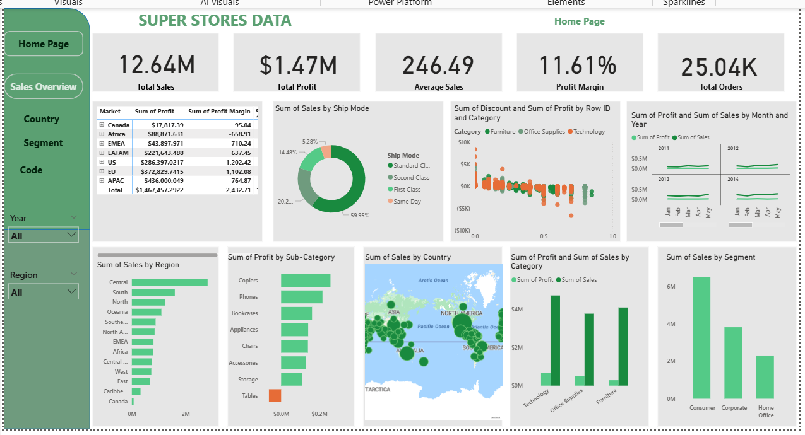

## Week 4 — HealthConnect Clinic Experience Lab (Data Analytics Track)

**Project:** From Week 4, the AnalystLab Africa internship shifted to a shared, portfolio-scale project: helping a fictional healthcare provider, HealthConnect Clinic, understand and reduce patient appointment no-shows using data and AI. Each track contributes a different piece — mine is Data Analytics.

**My objective:** Understand the appointment data well enough to identify the patterns behind no-shows, and translate them into business questions and KPIs that can guide clinic decisions — distinct from the Data Science track (prediction) and Generative AI track (patient-facing assistant).

### What I did this week
- Reviewed the 5,000-record appointment dataset and its data dictionary
- Ran a full data quality assessment (missing values, duplicates, logical consistency checks)
- Defined 5 business questions covering distance, appointment history, age/appointment type, reminders, and booking lead time
- Proposed and validated 5 KPIs against those questions using Excel pivot tables
- Documented assumptions, limitations, and risks

### Key preliminary findings
| Factor | Finding |
|---|---|
| Prior no-show history | Strongest signal — no-show rate climbs from 43.5% (0 prior no-shows) to 61.0% (2+ prior) |
| Booking lead time | No-show patients booked ~10 days further in advance on average than patients who attended |
| Reminders | Any reminder reduces no-shows vs. none; SMS performed best among channels |
| Distance | Modest effect only |
| Age / appointment type | Largely flat, except a lower no-show rate among patients 65+ |

*Note: this dataset's overall 48.5% no-show rate is well above real-world clinic norms, so the patterns above are treated as directional, not exact real-world percentages.*

### Files in this update
- `HealthConnect_Week4_Initial_Analysis_Document.docx` — full track-specific output (problem, resources, data quality, business questions, KPIs, approach, limitations)
- `HealthConnect_Week4_Project_Summary.docx` — concise summary
- `HealthConnect_Week4_Pivot_Analysis.xlsx` — supporting Excel workbook (pivot tables behind each KPI)

### Next (Week 5)
Finalize distance and booking-lead-time bands, build a Power BI dashboard with one visual per KPI, and draft recommendations grounded in the strongest findings (prior no-show history, reminder channel).

* # Global Superstore Executive Dashboard

**AnalystLab Africa — Data Analytics Internship Programme**
**Week 2: Business Intelligence & Interactive Dashboard Development**
**Week 3: Advanced Data Analysis, KPI Development & Business Intelligence Dashboard**

## Business Problem

Acting as a Junior Business Intelligence Analyst for a national retail client, this project transforms 51,290 raw transaction records from the Global Superstore dataset (2011–2014, spanning 147 countries and 7 markets) into an executive Power BI dashboard. The goal: give senior management a single view of sales performance, profitability, customer behavior, and regional performance — replacing manual spreadsheet review with an interactive, decision-ready report.

## Business Questions Answered

1. What is the overall sales performance of the company?
2. Which regions generate the highest sales and profit?
3. Which customer segments contribute the most revenue?
4. Which product categories perform best?
5. Which products are the most profitable?
6. What trends can be observed over time?
7. What recommendations should management implement to improve business performance?

## Dashboard Preview

*(Add a screenshot of your dashboard here — drag the image into this file in the GitHub editor, or use: 
* `)*

## Key Insights

- **Sales grew ~90% from 2011 to 2014** ($2.26M → $4.30M), but profit margin stayed flat at 11–12% — revenue is scaling faster than efficiency.
- **Central region and the APAC/EU markets carry the business** — Central leads by both sales ($2.82M) and profit ($311K); APAC ($3.59M sales) and EU ($2.94M sales) outperform the home US market.
- **Technology is the most profitable category** ($664K profit), while **Furniture is the least efficient** — and the Tables sub-category is the only one that's outright unprofitable, losing $64K overall.
- **Discounting above 20% destroys profit.** Orders with no discount run a 25% margin; every discount band above 20% is net loss-making, bottoming out at –139% margin on discounts of 60%+.
- **Consumer segment and Standard Class shipping drive the most value** — Consumer alone outperforms Corporate and Home Office combined, and Standard Class carries the bulk of profitable volume.

## Week 3: Advanced Analysis & KPIs

Building on the Week 2 dashboard, Week 3 added deeper time-based, customer, and product-level analysis, plus a formal KPI and DAX measure set.

**6 Dashboard KPIs:** Total Sales ($12.64M) · Total Profit ($1.47M) · Total Orders (25,035) · Total Customers (1,590) · Profit Margin (11.6%) · Average Sales per Order ($505)

**Additional findings:**
- Sales and profit growth are both accelerating year-over-year (sales +26.3%, profit +23.9% in 2014), not just growing in absolute terms.
- Q4 is a consistent, repeatable seasonal peak across all four years — useful for inventory and staffing planning.
- 678 of 3,788 products (18%) and 12,544 of 51,290 order lines (24.5%) are loss-making — the profitability issue is systemic discount-governance, not a few bad products.
- The customer base is well-diversified: the top 10 customers (of 1,590) account for only ~2.7% of total sales.
- Africa and Central Asia are the clearest growth opportunities — both convert sales to profit efficiently (17.6% and 11.3% margins) despite low volume, making them lower-risk to scale than fixing an underperforming large region.

See `Advanced_Data_Analysis.docx`, `KPI_DAX_Measures.docx`, and `Business_Insights_Recommendations_Week3.docx` for full detail.

## Recommendations

1. Cap discounting at 20% for Furniture and Technology categories.
2. Review pricing/supplier costs for the Tables sub-category and other chronic loss-makers.
3. Reallocate investment toward high-margin lines (Copiers, Phones) and efficient markets (Africa, Central Asia).
4. Promote Standard Class shipping as the default for lower-value orders.
5. Establish a quarterly regional performance review using this dashboard.

## Tools & Skills

- **Microsoft Power BI** — data modeling, DAX measures, interactive report design
- **Power Query** — data cleaning and transformation
- **DAX** — Total Sales, Total Profit, Total Orders, Average Sales, Profit Margin %, YoY Growth measures
- **Data quality auditing** — missing value review, duplicate detection, type correction
- **Business analysis & storytelling** — translating raw data into insights, risks, opportunities, and actionable recommendations

## Files in This Repository

| File | Description |
|---|---|
| `Global_Superstore_Dashboard_week3.pbix` | Power BI project file |
| `Global_Superstore_Dashboard_Week3.pdf` | Static export of the dashboard (both pages) |
| `BI_Overview_Report.docx` | Week 2: Business Intelligence overview report |
| `Executive_Summary_Report.docx` | Week 2: Insights, risks, opportunities, and recommendations |
| `Advanced_Data_Analysis.docx` | Week 3: Continuity summary, deeper analysis, and business problem investigation |
| `KPI_DAX_Measures.docx` | Week 3: KPI definitions and DAX measure documentation |
| `Business_Insights_Recommendations_Week3.docx` | Week 3: Insights and evidence-based recommendations |

---
*Part of the AnalystLab Africa Data Analytics Internship Programme.* `#AnalystLabAfrica`
