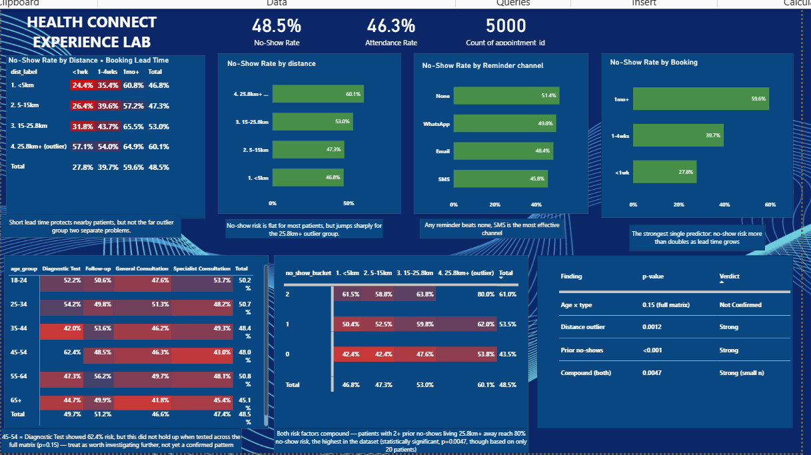
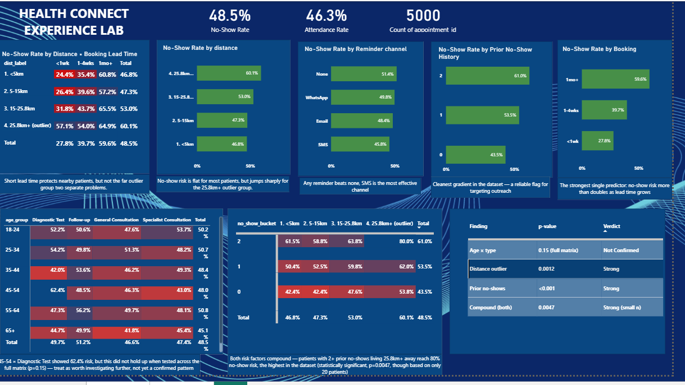
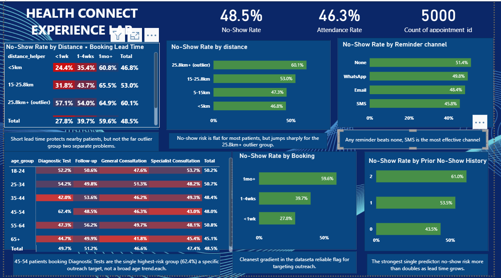

## Week 7 — HealthConnect Clinic Experience Lab (Data Analytics Track)

**Focus this week:** systematic testing, refinement, and — for the first time — a genuine, evidenced cross-track collaboration with the Data Science track.

### What I did this week
- Ran a formal 10-item Testing & Validation Record covering dashboard construction, KPI accuracy, filter behaviour, and statistical validity
- Found and fixed two real dashboard errors: a reminder-channel chart pulling the wrong field, and a distance-band sort order that defaulted to alphabetical (worked around a Power BI circular-dependency error with a label-based fix)
- Removed a redundant visual once a better one covered the same information, and resized the dashboard layout
- Re-tested the age × appointment-type finding rigorously  confirmed it does **not** survive full-matrix testing (p=0.15) and formally downgraded it, while re-confirming the two strongest findings (prior no-shows p<0.001, distance p=0.0012)
- Connected directly with a **Data Science track partner** working on the same dataset from a completely different angle (a prediction model)
- Compared independently-derived results: my top statistical predictors matched his model's top 2 features by importance exactly  neither of us knew the other's results beforehand
  Ran a reciprocal check on his behalf: two segments where his model underperformed showed no statistically real pattern in my data (p=0.50, p=0.24), telling him it's likely model noise, not a missed feature
  Proposed a concrete follow-up: an explicit interaction feature for the compound risk segment I found in Week 6, which his model doesn't currently have

### Key cross-track result
| Check | Result |
|---|---|
| Feature convergence | Full match — DS's top 2 features by importance = DA's top 2 statistically validated predictors |
| Leakage caution | Independently confirmed on both sides (waiting_time_minutes) |
| Age × type finding | Independently avoided by both sides — DS doesn't use it as a feature either |
| Reciprocal segment check | Neither of DS's 2 weak segments shows a real pattern in the underlying data |

### Files in this update
- `HealthConnect_Week7_Analytics_Testing_Refinement_Report.docx` — full track-specific output (testing record, validated findings, dashboard refinements, cross-track contribution, limitations)
- `HealthConnect_Week7_Project_Summary.docx` — concise summary
- `HealthConnect_Week7_EndToEnd_Validation_Input_UPDATED.docx` — submitted end-to-end validation evidence
- Updated Power BI dashboard () and Excel workbook

### Next (Week 8)
Follow up on the Data Science interaction-feature test result, standardise distance-band boundary handling, and prepare all validated findings and dashboard evidence for final integration and presentation.

## Week 6 — HealthConnect Clinic Experience Lab (Data Analytics Track)

**Focus this week:** moving from initial analysis (Week 5) into integration, deeper validation, and demonstrated cross-track collaboration.

### What I did this week
- Statistically validated 3 headline Week 5 findings using chi-square testing
- Discovered and corrected a multiple-comparisons issue: the age × appointment-type finding (62.4%) looked significant on its own (p=0.0097) but did not hold up when tested across the full matrix (p=0.15) — downgraded from a confirmed finding to "worth investigating further"
- Found a new, statistically significant compound risk segment: patients with 2+ prior no-shows **and** living 25.8km+ away reach an **80.0% no-show rate** (p=0.0047)
- Showed the reminder effect is roughly twice as strong within the high-risk group (12-point gap) as in the general population (5.6-point gap)
- Improved the Power BI dashboard: added a compound matrix visual and a statistical validation table, fixed a distance sort-order bug, added one-line takeaways under every visual
- Produced a 6-item, confidence-rated action list translating findings into specific HealthConnect actions
- Completed a real, evidence-backed cross-track integration with **Project Management** (submitted a structured Cross-Track Integration Questionnaire) after two direct outreach attempts to Data Science and ML Engineering went unanswered

### Key results
| Finding | p-value | Verdict |
|---|---|---|
| Prior no-shows (0/1/2+) | <0.001 | Strong — statistically real |
| Distance outlier (25.8km+) | 0.0012 | Strong — statistically real |
| Compound: prior no-shows × distance | 0.0047 | Real, but small sample (n=20) |
| Age × appointment type | 0.15 (full matrix) | Not confirmed — revised from Week 5 |

### Cross-track collaboration
Two direct outreach attempts (Data Science, then ML Engineering) received no response, so I escalated via the shared cohort group channel and, per the coordinator's process, submitted a full Cross-Track Integration & Progress Questionnaire to Project Management — giving them complete visibility into my validated findings and the specific blocker, so they can facilitate a direct pairing before the deadline.

### Files in this update
- `HealthConnect_Week6_Advanced_Analytics_Report.docx` — full track-specific output (validation, compound finding, revised conclusions, dashboard, action list, cross-track contribution)
- `HealthConnect_Week6_Project_Summary.docx` — concise summary
- `HealthConnect_Week6_CrossTrack_Questionnaire_FILLED.docx` — submitted cross-track integration evidence
- Updated Power BI dashboard () and Excel workbook

### Next (Week 7)
Confirm direct integration with Data Science or ML Engineering once facilitated by Project Management; monitor whether the compound risk finding holds as more data accumulates; begin end-to-end validation ahead of final testing and refinement.

## Week 5 — HealthConnect Clinic Experience Lab (Data Analytics Track)

**Focus this week:** Moving from Week 4's planning into actual analysis — calculating KPIs, building a dashboard, and producing business insights.

### What I did this week
- Reviewed and closed out data preparation (data types, categories, value ranges — all clean)
- Ran deeper exploratory analysis, including two genuine variable *interactions* (not just single-variable checks):
  - Reminder effectiveness varies by distance — reminders help mid-distance patients far more than the most distant ones
  - Short booking lead time only protects patients who live nearby
- Calculated all 5 KPIs proposed in Week 4, plus one bonus compound KPI
- Built an initial Power BI dashboard with 4 KPI charts and 2 matrix visuals (with conditional-formatting heatmaps)
- Produced 5 business insights plus one combined priority recommendation

### Key finding
Several variables that looked weak on a simple average in Week 4 — **distance** and **age** — turned out to have strong effects once banded or combined with a second variable. Averages can hide real patterns.

### Headline numbers
| KPI | Result |
|---|---|
| Prior no-shows (0/1/2+) | 43.5% → 53.5% → **61.0%** |
| Booking lead time (<1wk/1-4wks/1mo+) | 27.8% → 39.7% → **59.6%** |
| Distance (banded, incl. outlier group) | 46.5% → 47.3% → 52.8% → **61.0%** |
| Reminder channel | SMS 45.8% (best) vs. No reminder 51.4% |
| Age × appointment type (compound) | 41.8% to **62.4%** (45–54, Diagnostic Test) |

### Priority recommendation
Target SMS-based reminders specifically at patients with 2+ prior no-shows — combining the two strongest, most actionable findings into one proposal.

### Files in this update
- `HealthConnect_Week5_Initial_Analytics_Report.docx` — full track output (data prep, EDA, KPIs, dashboard, insights, limitations review)
- `HealthConnect_Week5_Project_Summary.docx` — concise summary
- `HealthConnect_Week5_Analysis.xlsx` — supporting Excel workbook
- `HealthConnect. pbix` — Power BI dashboard file

- ## Dashboard Preview
* `)*

### Cross-track collaboration
Reached out to cohort-mates on the Data Science, ML Engineering, and Generative AI tracks to share findings relevant to no-show prediction (prior no-show history, the waiting-time data-leakage caution). Collaboration write-up to follow once a reply is received.

### Next (Week 6)
Incorporate cross-track feedback, explore statistical validation of the smaller-sample findings, and begin translating the priority recommendation into a concrete action proposal.

## Week 4 — HealthConnect Clinic Experience Lab (Data Analytics Track)

**Project:** From Week 4, the AnalystLab Africa internship shifted to a shared, portfolio-scale project: helping a fictional healthcare provider, HealthConnect Clinic, understand and reduce patient appointment no-shows using data and AI. Each track contributes a different piece — mine is Data Analytics.

**My objective:** Understand the appointment data well enough to identify the patterns behind no-shows, and translate them into business questions and KPIs that can guide clinic decisions — distinct from the Data Science track (prediction) and Generative AI track (patient-facing assistant).

### What I did this week
- Reviewed the 5,000-record appointment dataset and its data dictionary
- Ran a full data quality assessment (missing values, duplicates, logical consistency checks)
- Defined 5 business questions covering distance, appointment history, age/appointment type, reminders, and booking lead time
- Proposed and validated 5 KPIs against those questions using Excel pivot tables
- Documented assumptions, limitations, and risks

### Key preliminary findings
| Factor | Finding |
|---|---|
| Prior no-show history | Strongest signal — no-show rate climbs from 43.5% (0 prior no-shows) to 61.0% (2+ prior) |
| Booking lead time | No-show patients booked ~10 days further in advance on average than patients who attended |
| Reminders | Any reminder reduces no-shows vs. none; SMS performed best among channels |
| Distance | Modest effect only |
| Age / appointment type | Largely flat, except a lower no-show rate among patients 65+ |

*Note: this dataset's overall 48.5% no-show rate is well above real-world clinic norms, so the patterns above are treated as directional, not exact real-world percentages.*

### Files in this update
- `HealthConnect_Week4_Initial_Analysis_Document.docx` — full track-specific output (problem, resources, data quality, business questions, KPIs, approach, limitations)
- `HealthConnect_Week4_Project_Summary.docx` — concise summary
- `HealthConnect_Week4_Pivot_Analysis.xlsx` — supporting Excel workbook (pivot tables behind each KPI)

### Next (Week 5)
Finalize distance and booking-lead-time bands, build a Power BI dashboard with one visual per KPI, and draft recommendations grounded in the strongest findings (prior no-show history, reminder channel).

* # Global Superstore Executive Dashboard

**AnalystLab Africa — Data Analytics Internship Programme**
**Week 2: Business Intelligence & Interactive Dashboard Development**
**Week 3: Advanced Data Analysis, KPI Development & Business Intelligence Dashboard**

## Business Problem

Acting as a Junior Business Intelligence Analyst for a national retail client, this project transforms 51,290 raw transaction records from the Global Superstore dataset (2011–2014, spanning 147 countries and 7 markets) into an executive Power BI dashboard. The goal: give senior management a single view of sales performance, profitability, customer behavior, and regional performance — replacing manual spreadsheet review with an interactive, decision-ready report.

## Business Questions Answered

1. What is the overall sales performance of the company?
2. Which regions generate the highest sales and profit?
3. Which customer segments contribute the most revenue?
4. Which product categories perform best?
5. Which products are the most profitable?
6. What trends can be observed over time?
7. What recommendations should management implement to improve business performance?

## Dashboard Preview

*(Add a screenshot of your dashboard here — drag the image into this file in the GitHub editor, or use: 
* `)*

## Key Insights

- **Sales grew ~90% from 2011 to 2014** ($2.26M → $4.30M), but profit margin stayed flat at 11–12% — revenue is scaling faster than efficiency.
- **Central region and the APAC/EU markets carry the business** — Central leads by both sales ($2.82M) and profit ($311K); APAC ($3.59M sales) and EU ($2.94M sales) outperform the home US market.
- **Technology is the most profitable category** ($664K profit), while **Furniture is the least efficient** — and the Tables sub-category is the only one that's outright unprofitable, losing $64K overall.
- **Discounting above 20% destroys profit.** Orders with no discount run a 25% margin; every discount band above 20% is net loss-making, bottoming out at –139% margin on discounts of 60%+.
- **Consumer segment and Standard Class shipping drive the most value** — Consumer alone outperforms Corporate and Home Office combined, and Standard Class carries the bulk of profitable volume.

## Week 3: Advanced Analysis & KPIs

Building on the Week 2 dashboard, Week 3 added deeper time-based, customer, and product-level analysis, plus a formal KPI and DAX measure set.

**6 Dashboard KPIs:** Total Sales ($12.64M) · Total Profit ($1.47M) · Total Orders (25,035) · Total Customers (1,590) · Profit Margin (11.6%) · Average Sales per Order ($505)

**Additional findings:**
- Sales and profit growth are both accelerating year-over-year (sales +26.3%, profit +23.9% in 2014), not just growing in absolute terms.
- Q4 is a consistent, repeatable seasonal peak across all four years — useful for inventory and staffing planning.
- 678 of 3,788 products (18%) and 12,544 of 51,290 order lines (24.5%) are loss-making — the profitability issue is systemic discount-governance, not a few bad products.
- The customer base is well-diversified: the top 10 customers (of 1,590) account for only ~2.7% of total sales.
- Africa and Central Asia are the clearest growth opportunities — both convert sales to profit efficiently (17.6% and 11.3% margins) despite low volume, making them lower-risk to scale than fixing an underperforming large region.

See `Advanced_Data_Analysis.docx`, `KPI_DAX_Measures.docx`, and `Business_Insights_Recommendations_Week3.docx` for full detail.

## Recommendations

1. Cap discounting at 20% for Furniture and Technology categories.
2. Review pricing/supplier costs for the Tables sub-category and other chronic loss-makers.
3. Reallocate investment toward high-margin lines (Copiers, Phones) and efficient markets (Africa, Central Asia).
4. Promote Standard Class shipping as the default for lower-value orders.
5. Establish a quarterly regional performance review using this dashboard.

## Tools & Skills

- **Microsoft Power BI** — data modeling, DAX measures, interactive report design
- **Power Query** — data cleaning and transformation
- **DAX** — Total Sales, Total Profit, Total Orders, Average Sales, Profit Margin %, YoY Growth measures
- **Data quality auditing** — missing value review, duplicate detection, type correction
- **Business analysis & storytelling** — translating raw data into insights, risks, opportunities, and actionable recommendations

## Files in This Repository

| File | Description |
|---|---|
| `Global_Superstore_Dashboard_week3.pbix` | Power BI project file |
| `Global_Superstore_Dashboard_Week3.pdf` | Static export of the dashboard (both pages) |
| `BI_Overview_Report.docx` | Week 2: Business Intelligence overview report |
| `Executive_Summary_Report.docx` | Week 2: Insights, risks, opportunities, and recommendations |
| `Advanced_Data_Analysis.docx` | Week 3: Continuity summary, deeper analysis, and business problem investigation |
| `KPI_DAX_Measures.docx` | Week 3: KPI definitions and DAX measure documentation |
| `Business_Insights_Recommendations_Week3.docx` | Week 3: Insights and evidence-based recommendations |

---
*Part of the AnalystLab Africa Data Analytics Internship Programme.* `#AnalystLabAfrica`
